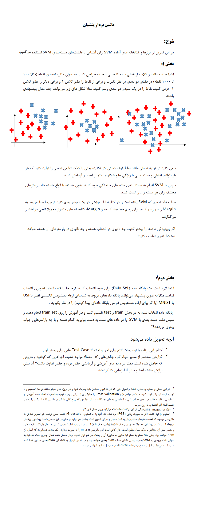

# **📏 Support Vector Machines Binary Classification Project | پروژه دسته‌بندی باینری ماشین‌های برداری پشتیبانی**

**A university project in which the binary classification of support vector machines is implemented with Python language.**

**یک پروژه دانشگاهی که در آن دسته‌بندی باینری ماشین‌های برداری پیشتبانی با زبان پایتون پیاده‌سازی میشود.**

# 💬 **نکات پروژه**

* برای اجرا برنامه، به پایتون بالاتر از نسخه 3.6 نیاز دارید.
* گزارش و عکس‌های برنامه در دایرکتوری Report قرار دارد.
* منابع استفاده‌شده در دایرکتوری Sources قرار دارند.
* ورودی برنامه در دایرکتوری USPS_images و نمونه خروجی برنامه در فایل results.txt قرار دارد.
* فاز اول و دوم به ترتیب main1 و main2 هستند.
* کتابخانه‌های مورد نیاز در فایل requirements.txt قرار دارند.
* برای دسترسی به همه‌ی پروژه‌های دانشگاهی من، به این لینک مراجعه کنید:

👈🏻 **[پروژه‌های دانشگاهی من](https://github.com/bestmahdi2/Uni__Bachelors_SKU_Path)**

# 📝 **توضیحات پروژه**

